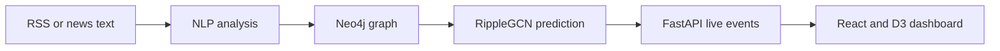

# AtmoGraph

AtmoGraph is a prototype supply-chain ripple-effect prediction system combining a Neo4j knowledge graph, NLP disruption detection, a PyTorch Geometric graph convolutional network, FastAPI, and an interactive React/D3 dashboard.

> **Scope:** The committed model is evaluated on synthetic scenarios. Its outputs demonstrate the architecture and are not production logistics forecasts.

## System flow



## Features

- Neo4j supply-chain nodes and operational relationships
- Entity matching and rule-based disruption classification
- Idempotent ingestion and dashboard-safe deduplication
- Two-layer RippleGCN node-impact prediction
- Authenticated FastAPI endpoints and server-sent live updates
- Geographic map and force-directed topology views
- Search, node details, risk overlays, and 30/60/90-day projections
- Automated backend tests, frontend checks, and model evaluation

## Technology

| Layer | Technology |
|---|---|
| Graph database | Neo4j |
| Backend | FastAPI, Python |
| NLP | spaCy, RapidFuzz, rule-based classification |
| Machine learning | PyTorch, PyTorch Geometric |
| Frontend | React, Vite, D3.js |
| Validation | pytest, Oxlint, Vite, GitHub Actions |

## Model evaluation

The committed report uses 15 held-out synthetic scenarios and 160 node-level predictions.

| Metric | RippleGCN | Training-mean baseline |
|---|---:|---:|
| MAE | 0.009256 | 0.038189 |
| RMSE | 0.011282 | 0.050464 |
| R² | 0.948684 | — |

This is a 75.76% MAE reduction and 77.64% RMSE reduction relative to the training-target mean baseline. Reproduce it with `python -m backend.python.evaluate_gnn`.

See [the final evaluation report](backend/reports/final_evaluation.md) for methodology and limitations.

## Local setup

```powershell
git clone https://github.com/AtmoGraph/AtmoGraph.git
Set-Location AtmoGraph
python -m venv .venv
.\.venv\Scripts\Activate.ps1
python -m pip install --upgrade pip
python -m pip install -r .\backend\requirements.txt
python -m spacy download en_core_web_sm
Copy-Item .env.example .env
```

Replace the placeholders in `.env`, start Neo4j, and seed the graph:

```powershell
python -m backend.python.seed_graph
python -m uvicorn backend.api.main:app --reload --port 8001
```

In another terminal:

```powershell
npm --prefix frontend install
npm --prefix frontend run dev -- --port 5174
```

Dashboard: http://localhost:5174 — API docs: http://127.0.0.1:8001/docs

## API endpoints

| Method | Endpoint | Purpose |
|---|---|---|
| GET | `/api/health` | Backend status |
| GET | `/api/graph` | Graph and derived summary |
| GET | `/api/disruptions` | Active deduplicated disruptions |
| POST | `/api/predictions` | Node-impact projection |
| POST | `/api/nlp/analyze` | Analyse text without persistence |
| POST | `/api/nlp/ingest` | Analyse and persist a disruption |
| POST | `/api/nlp/feeds/{feed_key}/analyze` | Analyse allowlisted RSS |
| GET | `/api/realtime/events` | Authenticated SSE stream |
| POST | `/api/realtime/scenarios` | Publish a live scenario |

## Validation

```powershell
python -m pytest backend/tests -v
python -m backend.python.evaluate_gnn
npm --prefix frontend run lint
npm --prefix frontend run build
```

The Week 4 checkpoint passed 39 backend tests, frontend linting, and a production build.

## Projection interpretation

The GNN predicts node impact for the validated baseline scenario. The 60-day and 90-day views apply a documented recovery curve; they are **not** independently trained forecasting models.

## Known limitations

- The dataset is synthetic and the canonical ML graph is small.
- Entity recognition is constrained to known entities and aliases.
- Disruption classification is rule-based, not a fine-tuned transformer.
- RSS availability depends on an external allowlisted source.
- Live events use an in-memory broker rather than a durable queue.
- Production use requires historical outcomes, temporal validation, calibration, monitoring, and a larger graph.

## Repository layout

```text
backend/api/       FastAPI, authentication, predictions and live events
backend/nlp/       Entity extraction, classification, RSS and Neo4j writing
backend/python/    Dataset, graph, training and evaluation pipeline
backend/reports/   Reproducible evaluation outputs
backend/tests/     Backend automated tests
frontend/src/      React dashboard and D3 visualisations
```
